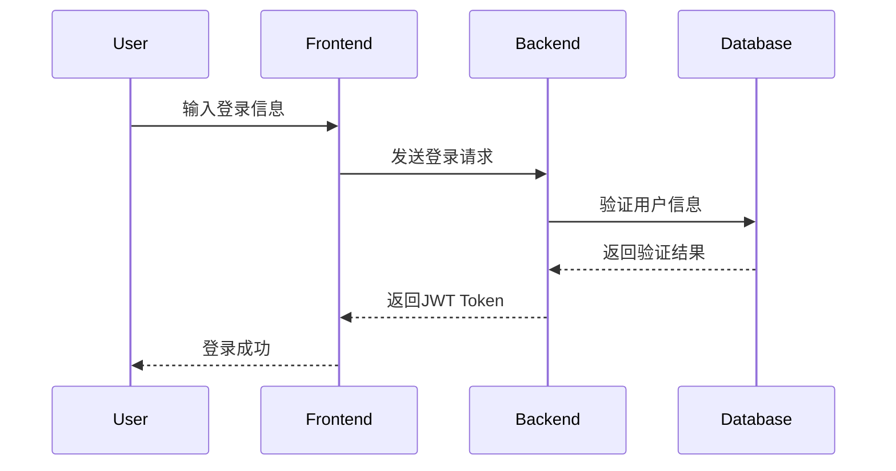
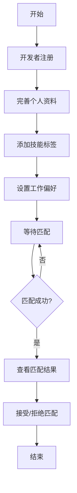
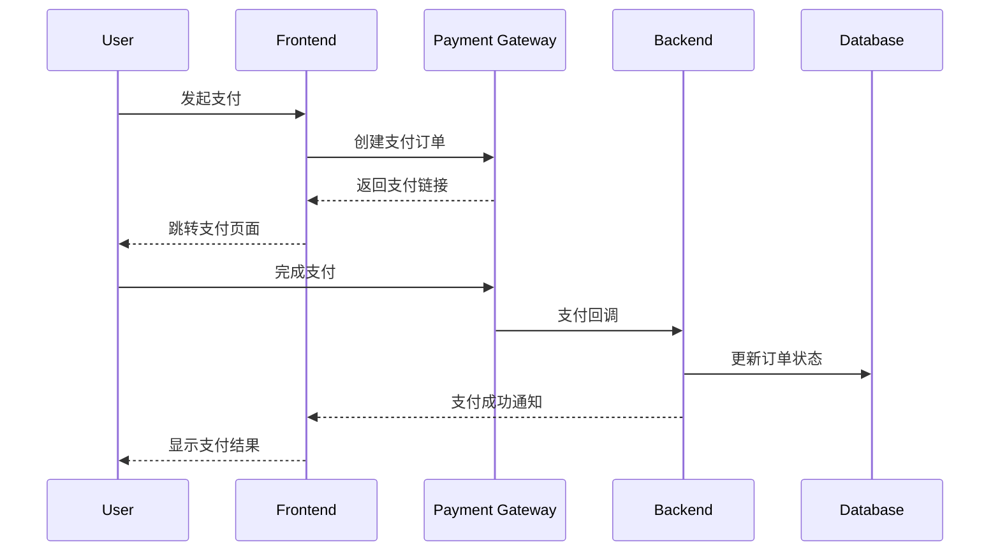
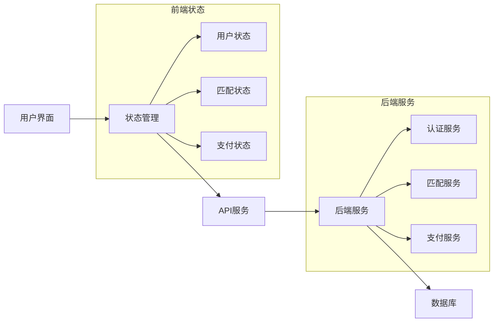
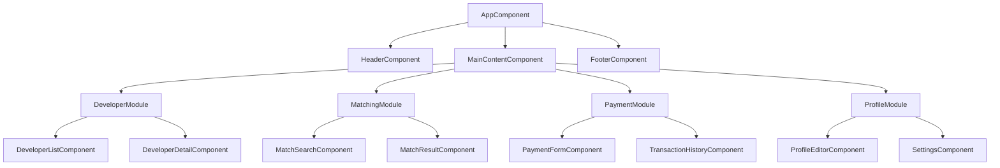
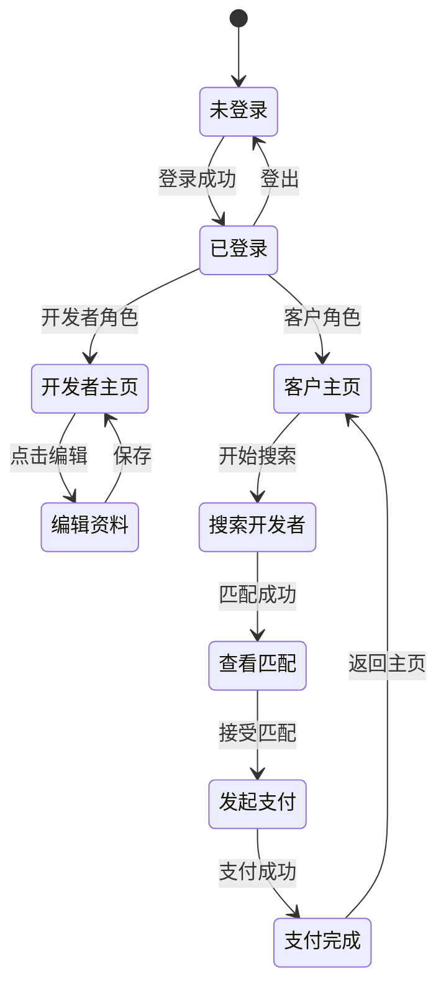
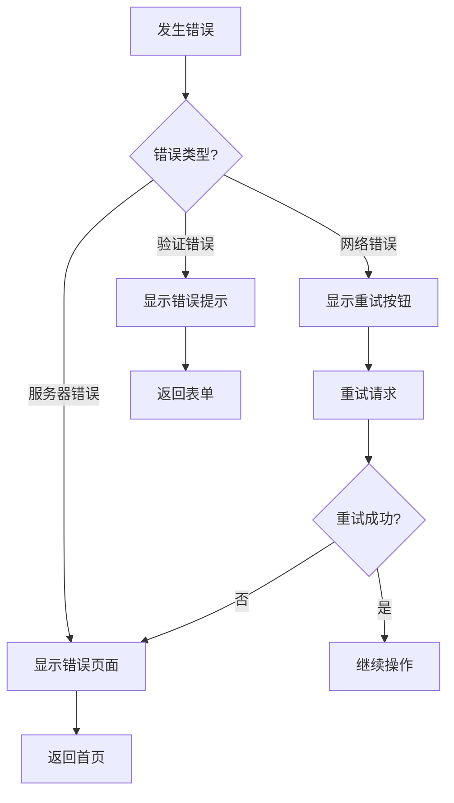
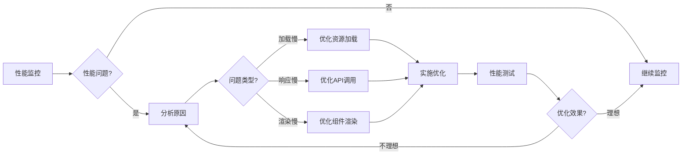

# Nominee Match 流程图文档

## 1. 用户认证流程

```mermaid
sequenceDiagram
    participant User
    participant Frontend
    participant Backend
    participant Database

    User->>Frontend: 输入登录信息
    Frontend->>Backend: 发送登录请求
    Backend->>Database: 验证用户信息
    Database-->>Backend: 返回验证结果
    Backend-->>Frontend: 返回JWT Token
    Frontend-->>User: 登录成功
```

## 2. 开发者匹配流程

```mermaid
graph TD
    A[开始] --> B[开发者注册]
    B --> C[完善个人资料]
    C --> D[添加技能标签]
    D --> E[设置工作偏好]
    E --> F[等待匹配]
    F --> G{匹配成功?}
    G -->|是| H[查看匹配结果]
    G -->|否| F
    H --> I[接受/拒绝匹配]
    I --> J[结束]
```

## 3. 支付流程

```mermaid
sequenceDiagram
    participant User
    participant Frontend
    participant Payment Gateway
    participant Backend
    participant Database

    User->>Frontend: 发起支付
    Frontend->>Payment Gateway: 创建支付订单
    Payment Gateway-->>Frontend: 返回支付链接
    Frontend-->>User: 跳转支付页面
    User->>Payment Gateway: 完成支付
    Payment Gateway->>Backend: 支付回调
    Backend->>Database: 更新订单状态
    Backend-->>Frontend: 支付成功通知
    Frontend-->>User: 显示支付结果
```

## 4. 数据流图

```mermaid
graph LR
    A[用户界面] --> B[状态管理]
    B --> C[API服务]
    C --> D[后端服务]
    D --> E[数据库]
    
    subgraph 前端状态
    B --> F[用户状态]
    B --> G[匹配状态]
    B --> H[支付状态]
    end
    
    subgraph 后端服务
    D --> I[认证服务]
    D --> J[匹配服务]
    D --> K[支付服务]
    end
```

## 5. 组件交互图

```mermaid
graph TD
    A[AppComponent] --> B[HeaderComponent]
    A --> C[MainContentComponent]
    A --> D[FooterComponent]
    
    C --> E[DeveloperModule]
    C --> F[MatchingModule]
    C --> G[PaymentModule]
    C --> H[ProfileModule]
    
    E --> I[DeveloperListComponent]
    E --> J[DeveloperDetailComponent]
    
    F --> K[MatchSearchComponent]
    F --> L[MatchResultComponent]
    
    G --> M[PaymentFormComponent]
    G --> N[TransactionHistoryComponent]
    
    H --> O[ProfileEditorComponent]
    H --> P[SettingsComponent]
```

## 6. 状态转换图

```mermaid
stateDiagram-v2
    [*] --> 未登录
    未登录 --> 已登录: 登录成功
    已登录 --> 未登录: 登出
    
    已登录 --> 开发者主页: 开发者角色
    已登录 --> 客户主页: 客户角色
    
    开发者主页 --> 编辑资料: 点击编辑
    编辑资料 --> 开发者主页: 保存
    
    客户主页 --> 搜索开发者: 开始搜索
    搜索开发者 --> 查看匹配: 匹配成功
    查看匹配 --> 发起支付: 接受匹配
    发起支付 --> 支付完成: 支付成功
    支付完成 --> 客户主页: 返回主页
```

## 7. 错误处理流程

```mermaid
graph TD
    A[发生错误] --> B{错误类型?}
    B -->|网络错误| C[显示重试按钮]
    B -->|验证错误| D[显示错误提示]
    B -->|服务器错误| E[显示错误页面]
    
    C --> F[重试请求]
    D --> G[返回表单]
    E --> H[返回首页]
    
    F --> I{重试成功?}
    I -->|是| J[继续操作]
    I -->|否| E
```

## 8. 性能优化流程

```mermaid
graph LR
    A[性能监控] --> B{性能问题?}
    B -->|是| C[分析原因]
    B -->|否| D[继续监控]
    
    C --> E{问题类型?}
    E -->|加载慢| F[优化资源加载]
    E -->|响应慢| G[优化API调用]
    E -->|渲染慢| H[优化组件渲染]
    
    F --> I[实施优化]
    G --> I
    H --> I
    
    I --> J[性能测试]
    J --> K{优化效果?}
    K -->|不理想| C
    K -->|理想| D
``` 
